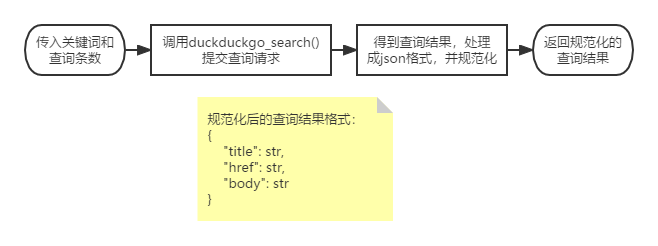
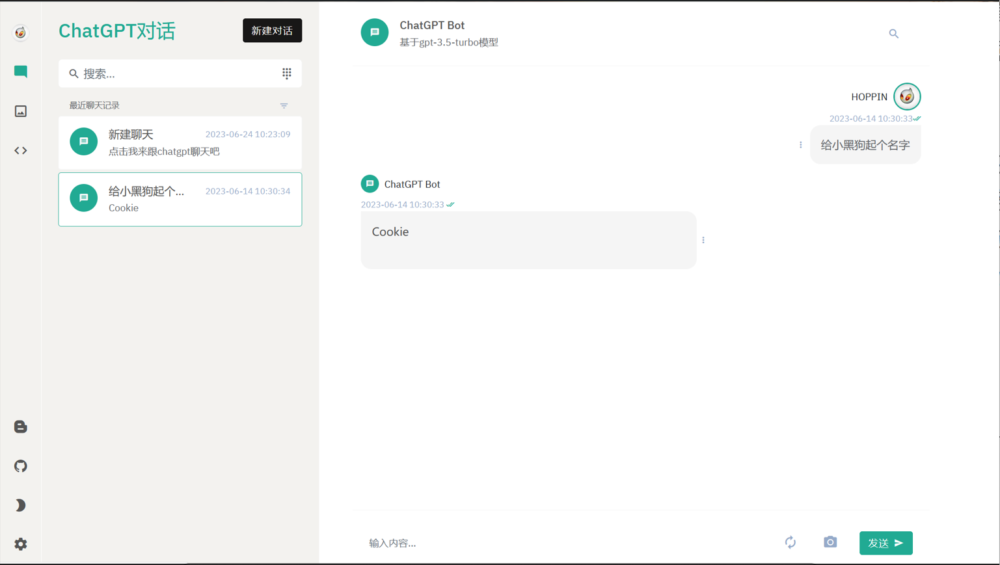

> *笔记作者：陆思宇 方正坤 王昕凯@无糖实习*  
> *笔记小编：黄诚@安全学术圈*

### 1、研究介绍

    Auto-Task 是一个实验性的开源应用程序，展示了 GPT-4 语言模型的能力。该程序由LLM大语言模型驱动，通过连接语言模型的"思考"，自主地实现你设定的任何目标。它展示了 大预言模型在自主决策和执行任务方面的潜力。

    Auto-Task利用大语言模型强大的自然语言处理能力，能够理解和生成自然语言文本。它可以接收用户设定的目标，并通过分析和推理生成一系列步骤，以实现这些目标。无论是撰写文章、解答问题、制定计划，还是执行复杂的任务，Auto-Task 都能通过与用户的对话来理解需求，并提供相应的解决方案。

    Auto-Task的灵活性和适应性使其成为各种场景中的有用工具。它可以用于个人的日常事务管理，例如制定旅行计划、组织日程安排或寻求创意灵感。在安全领域，Auto-Task主要的功能可以协助漏洞发布信息的相关搜集以及相关论文的自动化理解和分析，可以针对使用者的问题给出相对客观的答案。

    Auto-Task 的开源性质使得使用者能够自由探索和扩展其功能。它提供了一种研究和实验的平台，以进一步探索自然语言处理和人工智能领域的可能性。

    总之，Auto-Task 是一个令人印象深刻的应用程序，展示了大语言模型的创新能力。它通过自主连接大语言模型的逻辑推理功能，实现用户设定的目标。为之后安全方向的实践做了一定程度的探索。

### 2、构建思路

- prompt模块
  
  - prompt模块是auto-task类项目存在的核心和关键要素，该类型项目的主要功能便是基于大语言模型的理解能力按特定的格式命令宿主操作系统去执行一定的工作和任务，所以prompt的模式和构造条件十分重要。
  
  - 构造：
    
    常规prompt：
    
    ```
    You are Bob, AI  
    Your decisions must always be made independently without seeking user assistance.  
    The OS you are running on is: windows
    
    GOALS:
    
    1.总结之前的所有内容回答问题并输出在返回格式的"text"中，不执行命令Constraints:  
    
    1.Exclusively use the commands listed in double quotes e.g. "command name"
    
    Commands:  
    
    1.get html info: get html info, args: "url": "<url>"  
    
    2.download paper: DOWNLOAD PAPER BY KEYWORD, args: "keyword": "<keyword>"  
    
    3.google: Google Search, args: "query": "<query>"Resources:
    
    current finished:  
    
    You should only respond in JSON format as described below  
    Response Format:  
    {  
        "thoughts": {  
            "text": "what you thought,this part can be long",  
            "plan": "- short bulleted\n- list that conveys\n- long-term plan"  
        },  
        "command": {  
            "name": "command name",  
            "args": {  
                "arg name": "value"  
            }  
        }  
    }  
    Ensure the response can be parsed by Python json.loads
    ```
    
    我们可以把一个prompt分割为四个部分，说明、限制、命令、返回格式：
    
    1.说明：阐述你需要llm扮演的角色或使用场景
    
    2.限制：限制命令选择及任务限制必须在已有的命令条件下完成
    
    3.命令：可以允许选择的用来解决问题的命令
    
    4.返回格式：包括陈述，计划和命令控制，为json格式。
    
    prompt运行案例：
    
    例如上述的prompt中当你向llm询问怎么得知BBC今日报道时，其返回结果如下所示：
    
    ```
    {  
      "thoughts": {  
        "text": "Based on the BBC homepage HTML, here are the top news headlines today:",  
        "plan": "- Report the top headlines and summaries from [bbc.com](http://bbc.com/) homepage"  
      },  
      "command": {  
        "name": "get html info",  
        "args": {  
          "url": "[https://www.bbc.com/](https://www.bbc.com/)"  
        }  
      }  
    }
    ```

- 可以观察到llm告诉了我们它要获取BBC的报道的plan以及陈述，并返回了命令控制符，name为get html info，网站为[Home - BBC News](https://www.bbc.com/news)，于是操作系统便访问BBC主页分析并总结内容，llm再决定下一步的计划。
  
  ```
  class PromptGenerator:
  
      def __init__(self) -> None:
  
      self.constraints = [
      Exclusively use the commands listed in double quotes e.g. "command name" 
      ]  
      self.commands = []  
      self.resources = []  
      self.performance_evaluation = []  
      self.goals = []  
      self.command_registry = None  
      self.name = "Bob"  
      self.role = "AI"  
      self.response_format = {
      "thoughts": {  
          "text": "what you thought,this part can be long",  
          "plan": "- short bulleted\n- list that conveys\n- long-term plan",  
      },  
      "command": 
      {
      "name": "command name", 
      "args": {"arg name": "value"
      }
      }, 
      }
  ```

- 在每一步prompt构造时只需修改该对象中的内容，最后通过读取该对象的内容来生成最新需要的prompt即可。

- **命令目录及插件管理**
  
  ```
  def command(
  name: str,  
  description: str,  
  signature: str = "",  
  enabled: bool = True,  
  disabled_reason: Optional[str] = None,  
  ) 
  
  def decorator(func: Callable[..., Any]) -> Command:
  cmd = Command(  
      name=name,  
      description=description,  
      method=func,  
      signature=signature,  
      enabled=enabled,  
      disabled_reason=disabled_reason,  
  )  
  
  @functools.wraps(func)  
  def wrapper(*args, **kwargs) -> Any:  
      return func(*args, **kwargs)  
  
  wrapper.command = cmd  
  
  setattr(wrapper, AUTO_GPT_COMMAND_IDENTIFIER, True)  
  
  return wrapper 
  return decorator 
  ```
  
  ###### 当有新插件更新到项目时，仅需在插件参考中加入导入插件的python文件，即可自动导入文件中使用了如上装饰函数装饰的函数进可调用命令的目录中。

- 命令体构建
  
  

- prompt运行逻辑
  
  
  
  - 本项目目前实现的功能主要为联网查询及论文内容总结，为解决auto-gpt任务分解过盛的问题，我们采用简单的剩余任务分解数绑定任务类型的方式进行分解，举例：初始任务分解数为2，允许自主执行两次任务，llm首先执行搜索引擎的搜索工作，任务分解数+1=3，llm分析之后选取某一个网页进行爬取并得到内容总结，任务分解数-1=2，随后llm想根据已有知识总结得到答案，任务分解数-1-1=0，退出命令执行输出结果；

- memory模块
  
  - 存储功能
    
    - 存储本任务已执行操作的结果，包括论文总结，网页总结，命令执行记录
  
  - 总结调用
    
    - 当需要调用总结命令时，会把这些记录作为参考源提供给llm

## 文本处理（text_processing）模块总结

summarize_text()函数是text_processing模块中的一个辅助函数，功能为被其他模块的函数调用，接受传入的一段长度任意的文本字符串和指定的问题，并返回由模型基于这一段文本针对这一指定问题进行的总结。

```
def summarize_text(text: str, question: str) -> str:
    if not text:
        return "Error: No text to summarize"

    summaries = []
    chunks = list(
        split_text(text, max_length=3072, question=question),
    )

    for i, chunk in enumerate(chunks):
        messages = create_message(chunk, question)
        try:
            summary = chat_with_claude(message=messages)
            summaries.append(summary)
            time.sleep(10)
        except Exception as err:
            return f"Error: {err}"

    combined_summary = "\n".join(summaries)
    messages = create_message(combined_summary, question)

    return chat_with_claude(message=messages)
```

该函数利用split_text()函数将传入的文本分割成长度合适的文本块，然后将其包装成json格式发送给模型进行总结。为了保证最后的总结能够概括传入文本的所有内容，所有分段的总结内容会在最后重新组合在一起发送给模型进行一次总结。

```
import spacy
from chat import chat_with_claude

def split_text(text: str, max_length: int = 3000, question: str = "",) -> Generator[str, None, None]:
    flattened_paragraphs = " ".join(text.split("\n"))
    nlp = spacy.load("en_core_web_sm")
    nlp.add_pipe("sentencizer")
    doc = nlp(flattened_paragraphs)
    sentences = [sent.text.strip() for sent in doc.sents]

    current_chunk = []

    for sentence in sentences:
        message_with_additional_sentence = [
            create_message(" ".join(current_chunk) + " " + sentence, question)
        ]

        expected_length = count_message_length(message_with_additional_sentence)
        if expected_length <= max_length:
            current_chunk.append(sentence)
        else:
            yield " ".join(current_chunk)
            current_chunk = [sentence]
            message_this_sentence_only = [
                create_message(" ".join(current_chunk), question)
            ]
            expected_length = len(message_this_sentence_only) + 1
            if expected_length > max_length:
                raise ValueError(
                    f"Sentence is too long in webpage: {expected_length} tokens."
                )

    if current_chunk:
        yield " ".join(current_chunk)
```

split_text()函数是一个生成器，在调用spacy进行文本分词后依次生成限制长度的文本块返回给summarize_text()函数
在auto-GPT项目中，文本长度衡量和分割的方式是调用tiktoken库，将文本块转化为一段token，并以句子为单位计算当前长度的文本token消耗是否溢出。但tiktoken库是由openAI开发的子词标记化工具，在以chat-GPT为交互模型的项目上有很好的表现，但是在其他大语言模型上，由于其token构建方式的可能存在不同，不能保证使用效果；基于词向量化的文本分割功能开发尚未完全，因此当前项目的分段方式为测算字符串长度。

```
def create_message(chunk: str, question: str) -> Dict[str, str]:
    return {
        "content": f'"""{chunk}""" Using the above text, answer the following'
        f' question: "{question}" -- if the question cannot be answered using the text,'
        " summarize the text.",
    }

def count_message_length(messages: list) -> int:
    length = 0
    for message in messages:
        length += len(str(message))
    return length
```

需要进行总结的文本块会在create_message()函数中被包装成一个json格式的信息，该信息要求模型仅针对给定的文本内容回答问题或总结内容。

# 插件功能梳理

## 插件实现的通用原理

### · main函数：

```
command_registry = CommandRegistry()
command_categories = [
    "crawler_selenium",
    "paper_selenium",
    "autogpt.commands.google_search"

]
for command_category in command_categories:
    command_registry.import_commands(command_category)
```

新建CommandRegisry类并在command_catagories列表下写入待使用的插件名（文件名），由import_commands()函数导入对应插件，以确保相关函数可以在后续过程中被调用。

### · Command模块：

在CommandRegistry类下：

```
    def import_commands(self, module_name: str) -> None:

        module = importlib.import_module(module_name)

        for attr_name in dir(module):
            attr = getattr(module, attr_name)
            # Register decorated functions
            if hasattr(attr, AUTO_GPT_COMMAND_IDENTIFIER) and getattr(
                attr, AUTO_GPT_COMMAND_IDENTIFIER
            ):
                self.register(attr.command)
            # Register command classes
            elif (
                inspect.isclass(attr) and issubclass(attr, Command) and attr != Command
            ):
                cmd_instance = attr()
                self.register(cmd_instance)
```

该函数从导入的模块中的筛选被command装饰器标记的命令插件，并将这些插件注册为Command对象，最终添加到CommandRegistry对象的commands字典中。这样，在后续的操作中，可以通过命令名称从commands字典中获取对应的命令对象，以执行相应的操作。

### · 提示工程：

在PromptGenerator下：

```
    def __init__(self) -> None:

        self.constraints = [
            '只使用双引号中列出的命令。“命令名”'
        ]
        self.commands = []
        self.command_registry = None
```

在生成prompt时，要求模型只能使用注册在命令目录当中的命令，从而保证模型返回的任务执行步骤总能被某个插件响应。命令目录一般在主函数中会进行初始化。

```
    def add_command(
            self,
            command_label: str,
            command_name: str,
            args=None,
            function: Optional[Callable] = None,
    ) -> None:
        if args is None:
            args = {}

        command_args = {arg_key: arg_value for arg_key, arg_value in args.items()}

        command = {
            "label": command_label,
            "name": command_name,
            "args": command_args,
            "function": function,
        }

        self.commands.append(command)
```

该函数将每个命令创建一个包含标签、名称、参数和可调用函数的字典，并将该命令字典添加到命令列表中。

基于以上操作，所有给定的插件均在项目中完成了安装，并在之后的使用过程中根据模型给出的执行需求选择对应的命令执行。

## 当前实现的插件种类

- 谷歌搜索：
   使用DuckDuckGo引擎搜索关键词，返回一个保存有搜索结果和访问链接的列表
- 网页爬取和总结：
   爬取指定网页的所有前端文字内容，并根据给定的问题让模型进行总结
- 论文管理：
   在paperswithcode上下载指定关键词的论文，并总结内容

## 各插件功能的实现方式

### 谷歌搜索

DuckDuckGo是一种注重隐私保护的搜索引擎，为用户提供匿名化的搜索体验。该引擎在Python下可直接调用函数提交查询请求而无需使用API-Key，因此相较于直接使用谷歌搜索的API具有更好的安全性和项目搭建效率。  将关键词和结果条数提交给duckduckgo_search()后，函数以列表形式返回搜索结果，然后调用safe_google_search()函数将结果转换为如上所示的json标准格式。



### 网页爬取

 该功能基于Selenium构建爬虫进行网站爬取。访问指定网站加载完成后执行js脚本获取其所有文本内容，然后将这些内容分割到段，再把分割后的文本发送给模型进行内容总结。


### 论文管理

PDFMiner是一个可以从PDF文档中提取信息的工具，可以把PDF文件转换成HTML等格式。通过这个库，可以较为轻松地从PDF文件当中获取文本内容，从而进行后续操作。  


论文管理插件主要包含论文批量下载和批量阅读两个功能。
下载：当指定关键词后，该插件被调用，在paperswithcode上搜索关键词，然后依次访问并下载前数篇论文到本地指定路径。
阅读：从指定路径读取论文，调用PDFMiner对其进行解析，提取文本内容到content字符串中并保存为txt文件（可选），同时将内容发送给模型使其提取摘要。

#### 开源的ChatGPT应用项目查阅和对比

本方面我们查阅了大量的开源项目，对其源码进行分析阅读，总结了三个较为突出的开源项目并进行对比：

① **ChuanhuChatGPT**

​ 川虎为ChatGPT等多种LLM提供了一个轻快好用的Web图形界面和众多附加功能，其旨在为多个大语言模型提供连接接口和自由切换，使得用户可以方便的使用自己部署的大语言模型或者是GPT等模型的 api。在已经开源的项目中，川虎已经部署了主流的GPT的多个版本的模型接口以及其他部分大语言模型接口比如Moss，只要提供相应的api就可以和相应的的模型对话。


​ 同时，川虎GPT为大语言模型提供了多种补充功能和潜力挖掘，比如可以上传文件，用自带的prompt模板帮助用户获取更准确的答案，可以保存重要的对话并导出保存等等。此外，该系统还提供了用户的个性化服务，便捷用户的使用。

以下是一些该项目的使用技巧：

```json
使用System Prompt可以很有效地设定前提条件。
使用Prompt模板功能时，选择Prompt模板集合文件，然后从下拉菜单中选择想要的prompt。
如果回答不满意，可以使用 重新生成按钮再试一次
输入框支持换行，按 shift enter即可。
可以在输入框按上下箭头在输入历史之间切换
部署到服务器：在 config.json 中设置 "server_name": "0.0.0.0", "server_port": <你的端口号>,。
获取公共链接：在 config.json 中设置 "share": true,。注意程序必须在运行，才能通过公共链接访问。
在Hugging Face上使用：建议在右上角 复制Space 再使用，这样App反应可能会快一点。
```

​ 川虎系统的代码逻辑清晰，功能齐全，文件功能分工明确，易读易懂，二次开发的价值和潜力很大。但是正因为代码衔接紧密，因此想要单独剥离功能块的难度较高。川虎GPT本身是一个大语言模型功能的集成，在面向大语言模型应用领域还有很大的挖掘潜力。

② **Hoppin**

​ Hoppin为gitee网站上一名作者开源的基于 Java 语言的连接 ChatGPT 的 api 的项目。作者做了一个类GPT的对话聊天系统，同时为用户配置了较为详尽的 api 策略和费用统计。本项目的特点在于作者制作了较为美观的前端，并附加了图片上传和图片生成功能，并为用户提供了较为齐全的身份验证机制和 ChatGPT 的 api 管理策略。以下是一些项目图片。



​ 上图是项目的主界面，可以看到基本的聊天功能该项目都具备。


​ 上图是为用户设置的 api 管理功能。

​ 本项目的前端界面美观，并且功能相对较全，有利于二次开发和进一步的功能拓展。但比较遗憾的是，项目源码的逻辑设计和代码架构并不清晰，有些许混乱，初次接触源码的开发者可能需要一定的时间来梳理代码逻辑，这可能会是一个小小的缺憾。

③ **chatai-vue**

​ chatai-vue项目是使用 vue 高仿了 chatgpt 的前端，后端使用 python flask openai 实现。 后续作者又进行了 openai 的 api 更新，开放了最新的 gpt-3.5-turbo 模型，后端使用了最新模型在分支 toGpt3.5 上，加上了流式响应。 新模型更加强大，更加智能。本项目是完全类仿 ChatGPT 的界面制作的，意图使得拥有 api 的用户可以随时随地较为方便的使用ChatGPT的服务。以下是一些项目图展示。


​ 阅读本项目的源码后，觉得代码的逻辑结构清晰，功能设计条理，有很大的二次开发价值，因而，我们后续的项目便基于 chatai-vue 项目进行进一步的研发。

#### Auto-task前后端服务搭建

​ 本任务是前端框架和后端服务器的搭建，前端框架中使用 vue 高仿了一个类似 ChatGPT 的前端，服务器端的代码主要使用 Node.js和Express框架实现。

​ Vue.js（或简称为Vue）是一个用于创建用户界面的开源JavaScript框架，也是一个创建单页应用的Web应用框架。Vue所关注的核心是**MVC模式**中的**视图层**，同时，它也能方便地获取数据更新，并通过组件内部特定的方法实现视图与模型的交互。

```python
      MVC全名是Model View Controller，是模型(model)－视图(view)－控制器(controller)的缩写，一种软件设计典范，用一种业务逻辑、数据、界面显示分离的方法组织代码，将业务逻辑聚集到一个部件里面，在改进和个性化定制界面及用户交互的同时，不需要重新编写业务逻辑。MVC被独特的发展起来用于映射传统的输入、处理和输出功能在一个逻辑的图形化用户界面的结构中。
```

**项目部署**：

vue 前端：

下载依赖：

```shell
npm i
```

项目运行：

```shell
npm run dev
```


服务器sever.js文件，直接运行：


**项目结构**：


​ 就具体的业务逻辑，我们对每个新会话进行标注 cid ，并对会话中的每一次问答进行编号标注 idx ，并设定一些规则，例如`[DONE]`为服务器端回复内容的结束标志等等来方便后续的开发。

**项目展示：**


### 3、团队思考

    本项目团队由三位成员组成，我们致力于团队合作，并积极尝试了大语言模型在安全领域的探索应用。auto-task是以大语言模型为驱动的自动化任务处理工程，对于使用者的需求生成相应的propmt方案交由大语言模型理解并根据模型返回信息执行命令并决定之后的任务方案，团队在网页关键信息搜集，论文下载及总结，搜索引擎信息检索等方面作出了一定的努力，团队认为大语言模型的代码分析能力以及逻辑推理能力在安全领域具有十分广泛的应用价值，值得进一步的深入和研究。
