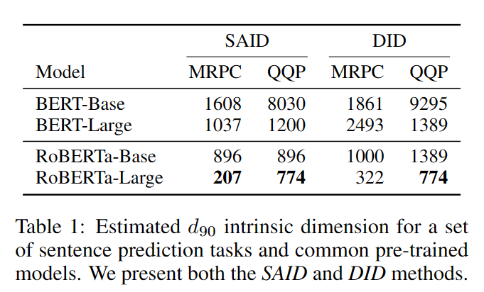
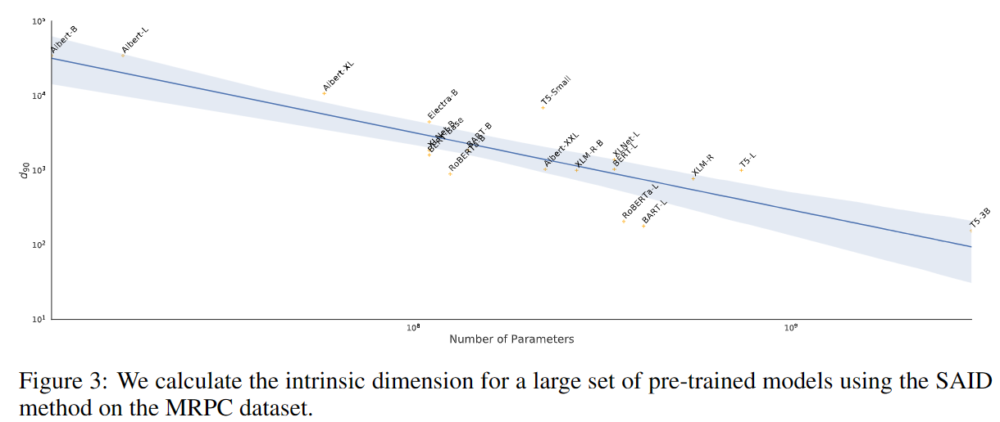

# Fine Tuning

默认情况下对模型所有参数进行调整

也泛指对模型参数进行微调以适应下游任务的技术

**Parameter-Efficient Fine-Tuning（PEFT）**

- P-Tuning（v2）
- Prefix Tuning
- Prompt Tuning
- LoRA

# Prompt

## 硬提示/离散提示（Hard Prompt/Discrete Prompt）

硬提示就是指人为设计上面提到的Prompt。硬提示一般需要模型在这个域上有比较多的经验，并且使用前需要知道这个模型的底层是什么样的。否则，硬提示的性能一般会比Fine-tuning的SOTA差很多。

- **人工构建（Manual Template）**
- **启发式法（Heuristic-based Template）** 通过规则、启发式搜索等方法构建合适的模板；
- **生成（Generation）** 根据给定的任务训练数据（通常是小样本场景），生成出合适的模板

## 软提示/连续提示（Soft Prompt/Continuous Prompt）（Prompt Tuning）

软提示把Prompt的生成本身作为一个任务进行学习，相当于把Prompt的生成从人类一个一个尝试（离散）变换成机器自己进行学习、尝试（连续）。

### Prefix-tuning

由Li等人在2021年提出，在生成式任务中效果优秀。这一方法保留了模型参数，并通过反向传播错误，调整每个encoder层和输入层前插入的prefix激活函数。从而对不同任务的微调模型只需要保存其对应的prefix参数。

每个任务唯一对应一套prefix，不支持多任务。

### Prompt-Tuning

保留完整预训练模型，仅允许每个下游任务有额外的k个可调整token置入于输入文本的头部。该方法和prefix tuning的差别在于——他没有在中间层插入prefix或添加额外的输出层，仅仅对输入的prompt进行了调整。

### 实现

1. "Span Corruption”：基于T5的预训练模型进行实现，T5的预训练进行句子空缺内容的预测，使用Span标注空缺位置，下面举个例子。

   - 输入：Thank you 〈X〉 me to your party 〈Y〉 week
   - 输出：〈X〉 for inviting 〈Y〉 last 〈Z〉

   其中输入中类似〈X〉的哨兵标注了空缺，输出表示对输入内容的填补，同样使用哨兵作为输出结尾

2. ”Span Corruption + Sentinel“：prompt tuning为了接近输入在预训练中的状态，微调时，向所有下游任务头部插入一个哨兵

3. “LM Adaptation”：延续T5进行少量额外的自监督训练，但以“LM”为目标（即Transformer中的解码器，基于上文预测下一个出现的token）。

   作者希望通过LM Adaptation，把模型速转换成一个更类似GPT-3的模型。

   由于这种方法与从头开始预训练的效果从未被比较过，文中尝试了不同Step下的Adaptation效果。

---

# LoRa（Low-Rank Adaptation）

## 现有方法缺点

- classic fine-tune：完全更新模型参数
- 缺点：参数量过大，效率低下，存储所有微调后的模型相当困难
- Adapter：在模型网络中插入Adapter层，在不影响原参数的情况下，对Adapter层内参数进行更新
- 缺点：设计引入了串行步骤，造成推理延迟“显著”提高（3%~30%，序列越短越明显），需要在效率和模型质量之间权衡
- prefix tuning
- 缺点：优化难度大，其性能在可训练参数增加时非单调变化。更重要的是，固定一部分序列长度必然会导致下游任务可用的序列长度减少，可能导致模型性能不如其他方法。

## 方法

- 特点

  不改变预训练模型权重，而在模型外添加旁路，用训练旁路中的矩阵模拟微调过程。

- 优点

  不引入额外延迟，只需要将旁路参数与模型参数合并，用新参数推理结果即可。

**假设**

**模型权重的更新矩阵有一个低秩**

## 本征维度intrinsic dimensionality

定义：目标函数达到精确解决优化问题所需的最小维度

在2020年，一项由[Aghajanyan等人](./【总结】LLM论文阅读（Finetune篇）-第二周/https://arxiv.org/abs/2012.13255)进行的研究衡量了模型微调的本征维度，尝试寻找对每个任务进行微调时需要多少空余参数才能大概解决优化问题

他们提出——预训练本身是在为下游NLP任务最小化本征维度，**预训练实际上是一个学习压缩平均NLP任务的框架**

### 本征维度计算

计算目标函数的精确本征维度非常困难，但可以使用启发式方法计算上界。

假设 $\theta^D=[\theta_0,\theta_1,...,\theta_m]$ 是模型 $f(·,\theta)$ 的D个参数。相比直接优化模型参数 $\theta^D$ 的损失函数，我们只关注参数的子空间，通过参数化d（d < D）个维度对模型进行微调：

$$
\theta^D=\theta^D_0+P(\theta^d)
$$

其中 $P:\mathbb{R}^d\rightarrow\mathbb{R}^D$，将参数从低维d映射到高维D。微调过程中，只有 $\theta^d$ 是变量，其他都是定值。

### 具体实现

定义达到训练完整权重矩阵效果的90%为令人满意的效果（如果完整模型训练后准确率85%，那么调整后目标准确率为0.9*85%=76.5%），称这个最小维度为 $d_{90}$。

- **DID.** 随机从所有参数中挑选 $\theta^d$ ，称这种方法找的的本征维度为Direct Intrinsic Dimension

$$
\theta^D=\theta^D_0+\theta^dM，M=HG\Pi HB
$$

- ****SAID.**** 对模型的每一层参数单独进行映射，以参数之和作为本征维度Structure Aware Intrinsic Dimension

$$
\theta^D_i=\theta^D_{0,i}+\lambda_i P(\theta^{d-m})_i
$$

### 本征维度计算结果

- MRPC：包含约3700个训练样本的段落文本语义一致性预测任务
- QQP：包含约363k个训练样本的问题文本语义一致性预测任务

### 结论

- 预训练模型效果越好，本征维度越小
- 训练集规模越大，本征维度越大

## 重新理解LoRA

现有预训练权重矩阵 $W_0\in\mathbb{R}^{d\times k}$ ，将权重更新表示为

 $W_0+\bigtriangleup W=W_0+BA$

其中 $B\in\mathbb{R}^{d\times r},A\in\mathbb{R}^{r\times k}$，秩 $r\ll min(d,k)$（可任意取值）。

在训练中，预训练权重矩阵保持不变，不接受梯度更新，而将$A,B$作为

训练参数矩阵。

使用高斯随机函数初始化A，使用0初始化B，因此$\bigtriangleup W$在训练开始时为0。

## 实现细节

在Transformer结构中，自注意力模块有4个权重矩阵 $W_q,W_k,W_v,W_o$，MLP（多层感知器，一种前向神经网络）模块有2个权重矩阵。实验中，LoRA只微调 $W_q,W_k,W_v$ 中的一个，相当于为下游任务调整时只变更注意力权重，而不变化MLP模块。

所有实验中，取秩$r=4$ （在1~64的取值中效果较好）。

## 实验效果

# Chinese-LLaMA-Alpaca

项目地址：[https://github.com/ymcui/Chinese-LLaMA-Alpaca](./【总结】LLM论文阅读（Finetune篇）-第二周/https://github.com/ymcui/Chinese-LLaMA-Alpaca)

LLaMA：2023年Facebook Meta发布的最新Transformer decoder大语言模型，主要基于英文数据进行训练，采用了包括**预归一化、SwiGLU 激活函数、旋转嵌入**等一系列优化措施。

Chinese-LLaMA-Alpaca

- 增加2000中文词汇，增强LLaMA的中文理解能力
- 采用LoRA进行模型高效训练和部署

## Pre-traing Stage-1

Chinese-LLaMA没有完全训练一个新模型，而是以原LLaMA得到权重作为初始状态，在中文数据集上继续进行预训练。

中文数据集（20G），仅有LLaMA训练语料大小的0.5%

方法

- 固定Transformer encoder中的参数——最小对化模型的扰动
- 训练embedding层参数——适应新添加的中文词向量

## Pre-traing Stage-2

方法

- 使用LoRA，并行调整Transformer注意力模块权重
- 训练embedding层和LM head层

LM head层：出现在大部分类GPT结构中，作为模型输出层，将hidden_states张量的最后一个维度映射到词典维度。

## Instruction Fine-tuning

由于微调采用的是 Stanford Alpaca 提出的对LLaMA的自指导微调方法来训练指令服从模型，此阶段产生的模型称为Chinese Alpaca。

方法

- 使用ChatGPT基于少量的指令数据Prompt，迭代进行指令数据的生成
- 使用LoRA，并行调整Transformer MLP模块权重

---

# 参考文献

- Liu X, Zheng Y, Du Z, et al. GPT understands, too[J]. arXiv preprint arXiv:2103.10385, 2021.
- Liu X, Ji K, Fu Y, et al. P-tuning v2: Prompt tuning can be comparable to fine-tuning universally across scales and tasks[J]. arXiv preprint arXiv:2110.07602, 2021.
- Li X L, Liang P. Prefix-tuning: Optimizing continuous prompts for generation[J]. arXiv preprint arXiv:2101.00190, 2021.
- Lester B, Al-Rfou R, Constant N. The power of scale for parameter-efficient prompt tuning[J]. arXiv preprint arXiv:2104.08691, 2021.
- Aghajanyan A, Zettlemoyer L, Gupta S. Intrinsic dimensionality explains the effectiveness of language model fine-tuning[J]. arXiv preprint arXiv:2012.13255, 2020.
- Hu E J, Shen Y, Wallis P, et al. Lora: Low-rank adaptation of large language models[J]. arXiv preprint arXiv:2106.09685, 2021.
- Touvron H, Lavril T, Izacard G, et al. Llama: Open and efficient foundation language models[J]. arXiv preprint arXiv:2302.13971, 2023.
- Wang Y, Kordi Y, Mishra S, et al. Self-Instruct: Aligning Language Model with Self Generated Instructions[J]. arXiv preprint arXiv:2212.10560, 2022.
- Cui Y, Yang Z, Yao X. Efficient and Effective Text Encoding for Chinese LLaMA and Alpaca[J]. arXiv preprint arXiv:2304.08177, 2023.

