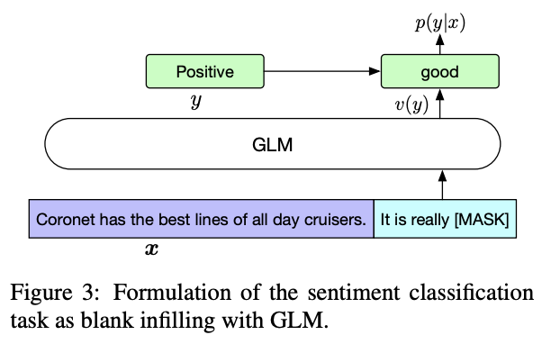
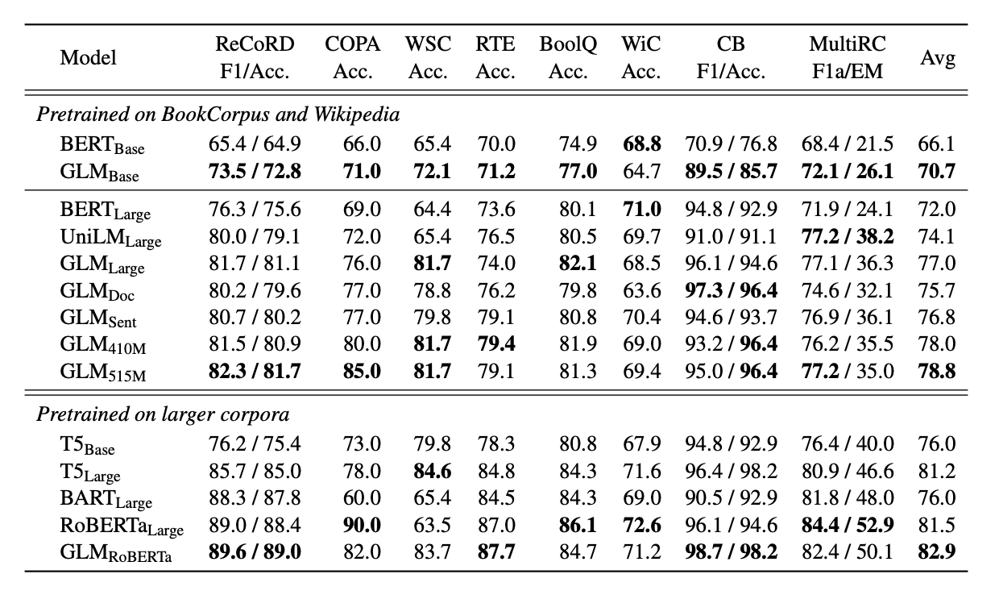
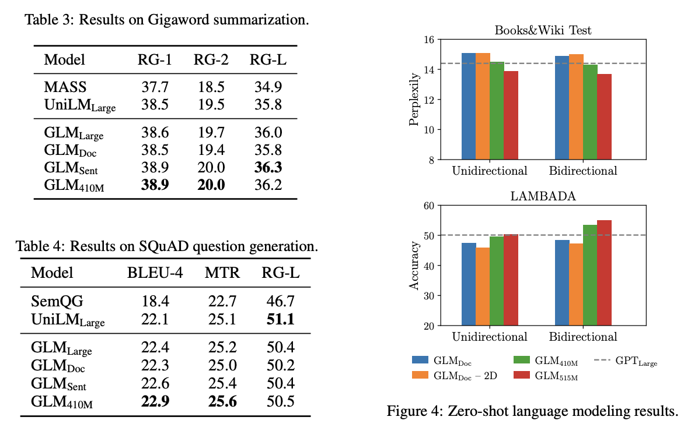

# NLP的主流架构

### 自回归模型（GPT）：

- 特点：自回归模型通过从左到右逐个生成文本的方式，具有较强的生成能力，能够生成长文本。在训练过程中，可以利用上下文信息进行预测，从而捕捉到一定的语义关联。
- 优点：生成效果较好，能够生成连贯的、上下文相关的文本。适用于无条件生成任务，如生成文章、对话等。
- 缺点：由于是单向模型，无法直接获取后文信息，可能导致在某些需要全局信息的任务中表现不佳。生成过程相对较慢。

### 自编码模型（BERT）：

- 特点：自编码模型使用双向Transformer作为编码器，在文本理解任务中具有较好的表现。能够利用上下文信息建模词语之间的关系，获取丰富的语义表示。
- 优点：具有较强的语言理解能力，适用于下游任务，如文本分类、分词、句法分析、信息抽取等。可以直接应用于许多NLU任务，而无需额外微调。
- 缺点：在文本生成任务中，由于缺乏显式的生成机制，无法直接生成文本。

### 编码解码模型（T5）：

- 特点：编码解码模型使用双向注意力的编码器和单向注意力的解码器，并通过交叉注意力连接两者。在有条件生成任务（seq-seq）中表现良好，如文本摘要、回答生成等。
- 优点：既具备编码器的语言理解能力，又能通过解码器生成文本，可适用于多种任务。能够综合编码解码的优势，实现一定程度上的任务统一。
- 缺点：相比于专门针对某一任务的模型，编码解码模型在某些特定任务上的性能可能不如专门优化的模型。

# NLP的主流任务

### 自然语言理解

- 文本分类：将给定的文本分为不同的预定义类别。
- 分词：将连续的文本序列划分为有意义的单元（词、子词等）。
- 信息抽取：从文本中抽取结构化信息，如实体关系、事件等。

### 无条件生成

- 文本生成：在没有给定特定条件的情况下，生成连贯、有意义的文本，如文章、故事、对话等。
- 语言建模：通过预测下一个词语或字符来生成自然语言序列，用于语言模型训练和生成文本。

### 条件生成

- 机器翻译：将一种自然语言的文本翻译成另一种自然语言的文本。
- 文本摘要：将长文本压缩成简短的摘要，捕捉主要信息。
- 生成式推理：在给定条件的情况下，生成符合逻辑的推理结果。

|  | 自然语言理解 | 条件生成 | 无条件生成 |
| --- | --- | --- | --- |
| 自回归模型 | —— | —— | ✓ |
| 自编码模型 | ✓ | ✕ | ✕ |
| 编码解码模型 | —— | ✓ | —— |

`**注释**：✓表示擅长；✕表示无法应用；——表示可以应用`

总而言之，没有一个框架能同时做到对三个主流任务都表现最佳。论文作者由此提出了GLM（Generalized Language Model）模型，实验结果表明，在相同的模型大小和数据量下，它在自然语言理解、有条件生成和无条件生成等任务上都优于BERT、GPT和T5等模型。

# GLM的主要特点

1. **自回归空白填充**：GLM通过在输入文本中随机选择一段连续的token并将其置为空白（Blank），然后使用自回归的方式重新构建这段空白内容。这种方法使得GLM能够同时进行语言理解和生成任务，通过预测空白部分来捕捉上下文信息。
2. **二维位置编码**：GLM引入了2D位置编码技术，用于表示跨度（span）内部和跨度之间的信息。这种编码方式使得GLM能够更好地建模不同位置之间的关系力。
3. **随机顺序预测跨度**：GLM在训练过程中允许以随机的顺序预测跨度，即可以先预测跨度的起始位置，再预测结束位置。这种随机顺序的预测能够增强模型对长跨度和复杂跨度的建模能力。

# **自回归空白填充**

> 自回归空白填充通过对输入文本中的一些连续片段进行随机掩码处理，然后以自回归的方式预测被掩码的部分
> 

`注释：[M] := [掩码]，[S] := [开始]，[E] := [结束]`

1. 数据处理：
    - 从输入文本中随机采样多个文本片段，每个片段是一段连续的标记序列。
    - 将选中的文本片段替换为特殊的 [MASK] 标记，形成一个损坏的文本。
    - 将损坏的文本和被替换的文本片段组成的部分称为 Part A，其余的文本片段构成的部分称为 Part B。
2. 自回归建模：
    - GLM以自回归的方式从损坏的文本中预测被掩码的标记。在预测一个片段中被掩码的标记时，模型可以访问损坏的文本和之前预测的片段。
    - 为了捕捉不同片段之间的相互依赖关系，片段的顺序会被随机打乱，类似于置换语言模型。
    - 模型按照从左到右的顺序逐个生成片段中被掩码的标记。
3. 输入与输出：
    - 将 Part A 和 Part B 拼接在一起作为 GLM 模型的输入。
    - 每个被掩码的文本片段在输入时前面加上 [START] 标记，在输出时后面加上 [END] 标记。
    - 通过二维位置编码来表示片段之间和片段内部的位置关系。
4. 自注意力机制：
    - 在自注意力机制中，Part A 中的标记只能与自身的标记相互关注，而不能关注 Part B 中的标记。（蓝框）
    - Part B 中的标记既可以关注 Part A 中的标记，也可以关注自身之前的标记。（黄色框和绿色框）

论文作者表示，GLM的自回归空白填充方法使用泊松分布，采样出长度为 λ = 3 的跨度，并不断重复采样，以确保至少15%的标记被掩码。论文作者通过实验发现，这个15%的比例对于下游自然语言理解任务的良好性能至关重要。

# 多任务训练

> GLM进行了多任务预训练，旨在训练一个能同时处理NLU和文本生成的单一模型。
> 
1. 文档级别任务（Document-level）：随机采样一个跨度（span），其长度从原始文本长度的50%到100%的均匀分布中抽样。这个目标旨在让模型能够生成长文本内容。
2. 句子级别任务（Sentence-level）：限制掩码跨度必须是完整的句子。通过随机采样多个跨度（句子）来覆盖原始标记的15%。这个目标旨在进行序列到序列（seq2seq）任务，其中预测通常是完整的句子或段落。

这两个新的目标任务与自回归空白填充具有相同的定义方式，即通过最大化预测概率来优化模型参数。区别在于跨度的数量和长度。

# 模型结构

> GLM使用了单个Transformer作为模型的主体架构，并对其进行了一些修改
> 
1. 重新排列了层归一化（Layer Normalization）和残差连接（residual connection）的顺序，这是为了避免数值错误，特别是在大规模语言模型中（如Megatron-LM）。
2. 使用了单个线性层（linear layer）进行输出标记的预测。这个线性层用于生成模型的输出，即对下一个标记进行预测。
3. 将ReLU激活函数替换为GELU激活函数。GELU（Gaussian Error Linear Unit）通过加权输入的值来非线性地激活，而不是像ReLU那样通过输入的符号来门控。选择GELU是因为神经元输入通常遵循正态分布，特别是在使用批归一化时。它在计算机视觉、自然语言处理和语音任务中都取得了改进效果。

## 微调

在GLM中，为了进行下游的NLU任务微调，传统的做法是将预训练模型生成的序列或标记表示作为线性分类器的输入来预测正确的标签。然而，这种做法会导致预训练和微调之间存在不一致性。

为了解决这个问题，GLM借鉴了PET（Pattern-Exploiting Training）的思想，将NLU分类任务重新构造为空白填充的生成任务。

具体而言，对于给定的带有标签的示例（x，y），通过模式将输入文本x转换为一个完形填空问题c(x)，其中模式包含一个单独的掩码标记。模式以自然语言的形式编写，以表示任务的语义。

例如，情感分类任务可以表示为“{SENTENCE}。It's really [MASK]”。候选标签y ∈ Y也被映射为完形填空问题的答案，称为verbalizer v(y)。在情感分类中，标签“positive”和“negative”被映射为单词“good”和“bad”。给定输入x的条件下，预测标签y的概率可以表示为：

其中Y是标签集合。句子是积极还是消极的概率与在空白中预测“good”或“bad”的概率成正比。然后，使用交叉熵损失对GLM进行微调。

# 分析与比较

### 与BERT相比

- BERT在处理连续的多个掩码标记时存在困难，因为BERT假设掩码标记之间是独立的，无法捕捉它们之间的依赖关系。
- BERT不能正确地填充多个掩码标记的空白。对于预测长度为l的答案，BERT需要进行l次连续预测。如果答案的长度l是未知的，那么可能需要枚举所有可能的长度。

### 与XLNet相比

GLM和XLNet都采用了自回归的预训练目标，但存在两个区别：

- XLNet在文本损坏之前使用原始的位置编码，在推断过程中需要知道或枚举答案的长度，这与BERT存在相同的问题。
- XLNet使用了双流的自注意力机制来避免Transformer内部的信息泄漏，但这增加了预训练的时间成本。

### 与T5相比

T5提出了类似的空白填充任务目标，但区别在于

- T5在编码器和解码器中使用独立的位置编码，依赖于多个哨兵标记来区分不同的掩码跨度。
- T5只使用一个哨兵标记，导致了模型能力的浪费和预训练微调的不一致性。
- T5总是按照固定的从左到右顺序预测掩码跨度。相比之下，GLM在NLU和seq2seq任务上需要更少的参数和数据。

### 与UniLM相比

UniLM通过在自动编码框架下改变双向、单向和交叉注意力之间的注意力掩码来结合不同的预训练目标。然而UniLM的缺点在于

- UniLM始终将掩码跨度替换为[mask]标记，限制了它对掩码跨度及其上下文之间依赖关系的建模能力。对比之下，GLM通过输入先前的标记并自回归地生成下一个标记来实现预训练和微调。
- UniLM在微调下游生成任务时也依赖于掩码语言建模，效率较低。然而，GLM通过自回归方式统一了NLU和生成任务。

# 实验

### ****SuperGLUE****

`注释：可以看出GLMBase 得分比BERT Base 高 4.6%，GLMLarge 得分比BERT Large 高 5.0%。`

在多任务预训练的情况下，GLMDoc和GLMSent的性能略低于GLMLarge，但仍然优于BERTLarge和UniLMLarge。在多任务模型中，GLMSent的性能比GLMDoc平均高出1.1%。将GLMDoc的参数增加到410M（BERTLarge的1.25倍）可以获得比GLMLarge更好的性能。具有515M参数（BERTLarge的1.5倍）的GLM性能更好。

### Sequence-to-Sequence

在上面表格中展示了在更大语料库上训练的模型的结果。GLMRoBERTa可以达到与序列到序列BART模型相媲美的性能，并且优于T5和UniLMv2模型。

在下面的表格中展示了在BookCorpus和Wikipedia上训练的模型的结果。观察到，GLMLarge在这两个生成任务上的性能与其他预训练模型相当。GLMSent的性能比GLMLarge更好，而GLMDoc的性能略低于GLMLarge。这表明，文档级目标对于条件生成任务的帮助较小，因为条件生成任务更注重从上下文中提取有用信息。将GLMDoc的参数增加到410M可以获得两个任务上最佳性能。

### 文字填充

GLM 大大优于以前的方法，1.3 到 3.9 BLEU。在此数据集上取得了最优秀的结果。

### 消融实验

> 作者进行了一系列的消融实验以评估GLM模型的不同组成部分对性能的影响
> 
- GLM模型在NLU任务上表现优于BERT，并且明显优于使用Masked LM预训练的BERT模型。
- GLM相对于类似的cloze-style微调的BERT模型，在处理可变长度空白的任务上表现更好，特别是在包含多个标记的verbalizer的任务中。
- 对于大模型而言，采用cloze-style微调可以显著提高GLM在NLU任务上的性能。
- 在消融实验中，去除span shuffling和使用不同的哨兵标记代替单个[MASK]标记都导致GLM模型性能下降，这说明这些设计对于GLM的性能至关重要。
- GLM与T5在预训练目标和设计上存在差异，但GLM在实验结果中展现了其优势。

# 总结

论文作者提出了GLM（General Language Model），一种新的通用语言模型，通过自回归空白填充的方式实现了同时处理自然语言理解、有条件生成和无条件生成任务的能力。

GLM通过自回归生成被掩码的文本部分，结合二维位置编码和随机顺序预测跨度的方法，提升了模型对上下文信息和长跨度依赖关系的建模能力。

论文作者认为在多任务预训练和微调阶段，GLM的性能优于BERT、GPT和T5等模型。其设计的实验表明，GLM在多个NLU任务、文本生成任务和文本填充任务上都取得了优秀的结果，并且其性能明显优于其他模型。