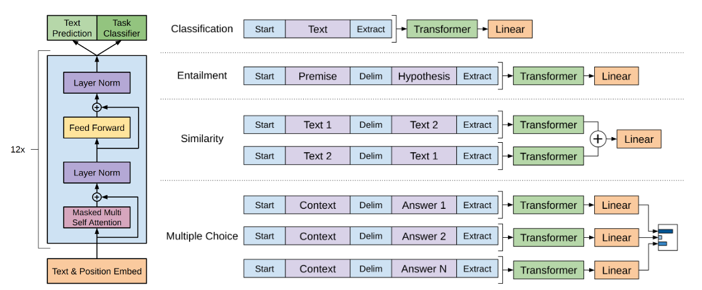

# 模型结构

GPT模型包含2个阶段：pre-training和fine-tuning。pre-training阶段从大量的无标签文本中学习建立语言模型。fine-tuning阶段基于标注的数据集针对下游分类任务进行训练。这种设计方案与BERT模型类似，但其实初代GPT的发布时间更早。

## 无监督预训练

GPT与BERT主要的差异之一是GPT使用Transformer模型的decoder结构，而BERT使用encoder结构。

给定一个tokne样本  $U= \{u_1,...,u_n\}$，GPT使用标准的language modeling目标最大化以下函数：

$$
L(U)=\sum_i\log P(u_i|u_{i-k},…,u_{i-1};\Theta)
$$

从模型的目标函数可以看出，GPT使用了单向的上文信息传递，这种方法比BERT的双向语言模型损失了部分信息，但个人认为这种上文信息+decoder的设计使得GPT更加适用于文本生成任务。

## **有监督微调**

现有数据集 C，其中每个用例包含输入tokens $x^1,...,x^m$ ，其标签为 $y$。基于预训练模型，可以获取最后一层transformer的激活序列 $h^m_l$。通过增加一层额外的线性输出层，训练其中的参数 $W_y$，GPT可以实现对数据集分类任务的微调，而不影响预训练中的参数。

$$
P(y|x^1,...,x^m)=softmax(h^m_lW_y)
$$

得到待训练的目标函数：

$$
L_2(C)=\sum_{(x,y)}\log P(y|x^1,...,x^m)
$$

GPT在此基础上增加了一个额外目标——language modeling，多项研究证明该目标可以提高监督模型的质量并加快参数融合。因此，GPT使用带权重 $\lambda$ 的目标函数进行优化。

$$
L_3(C)=L_2(C)+\lambda*L_1(C)
$$

## **不同任务的输入转换**

在处理文本分类以外的任务，如问题回答，需要输入有序的句子对或三元组。由于模型基于连续的文本序列进行训练，这些结构化的数据需要进行额外的处理或更改模型结构。GPT提出一种遍历式方法，在数据处理中引入迁移学习，把结构化输入转换为有序序列。

- 信息蕴含：将前提和假设连接，中间插入分隔符 ($)，作为输入。
- 文本相似：两个句子分开处理得到两个 $h^m_l$，将两个序列逐元素相加的结果传到输出层。
- 问题回答和常识推理：给定三元组（文档$z$，问题$q$，一组可能的回答$\{a_k\}$）。将文档和问题连接后，分别与每个可能答案使用分隔符连接得到 $\{z;q;\$;a_k\}$ 。将所有得到的序列独立输入模型，通过softmax层对输出进行归一化，生成可能的答案上的概率分布。

