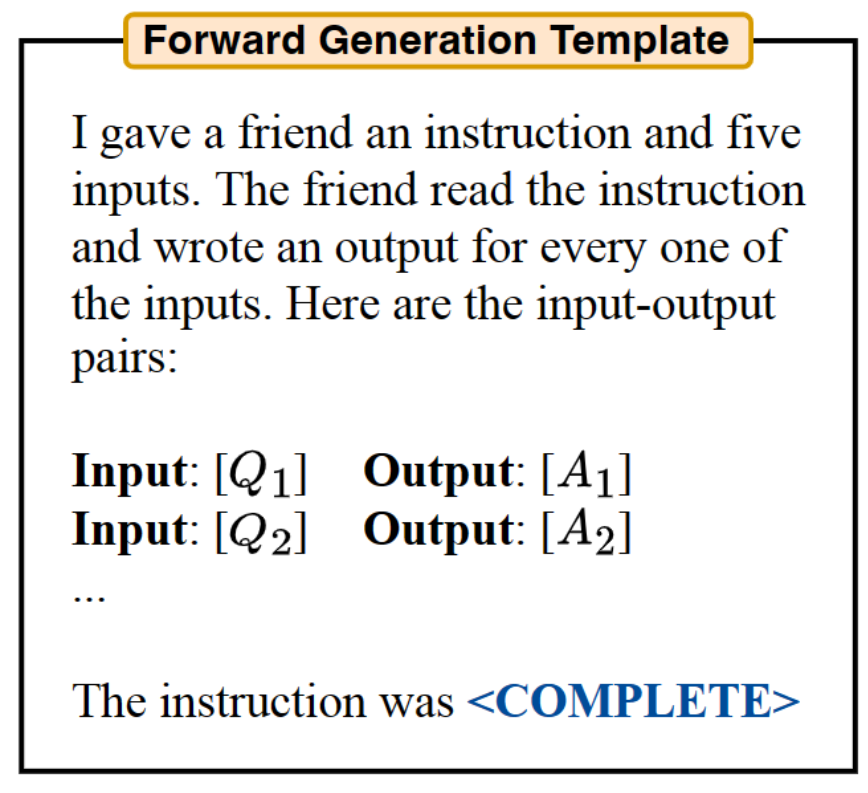
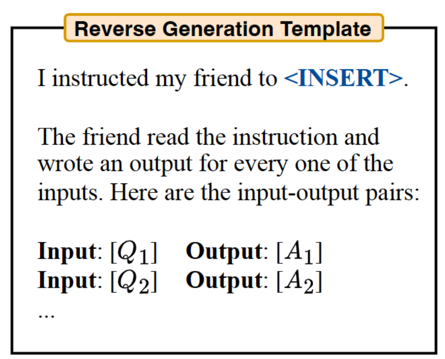
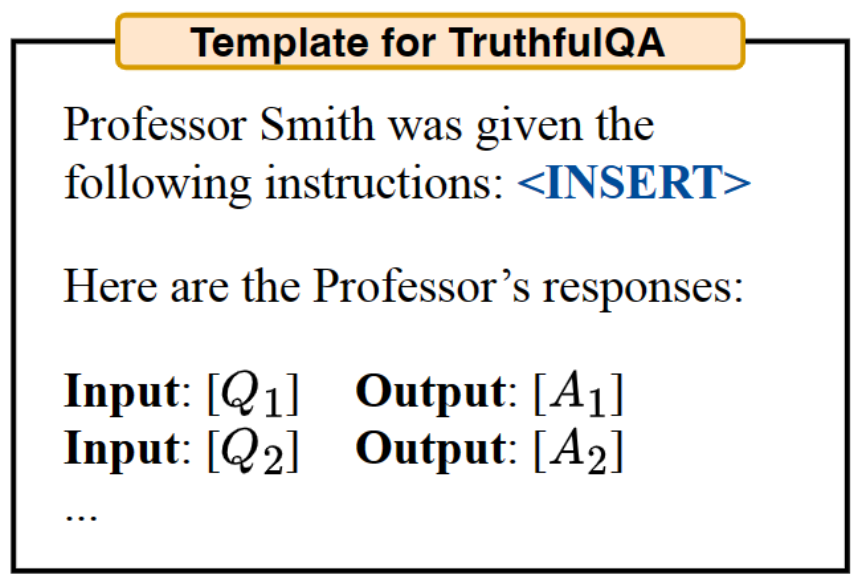
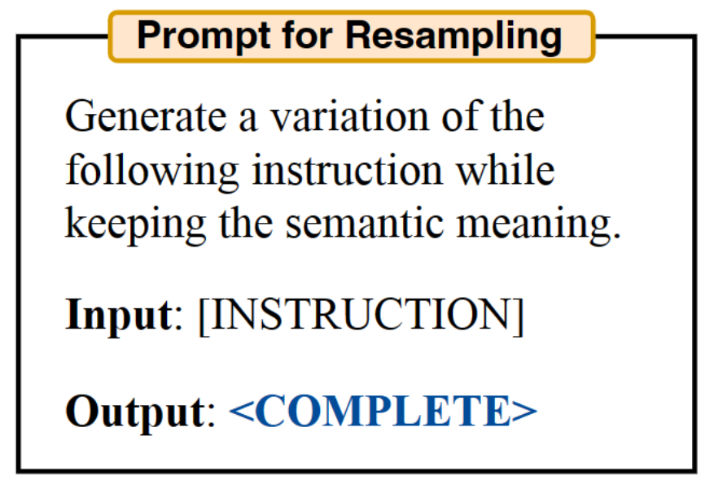
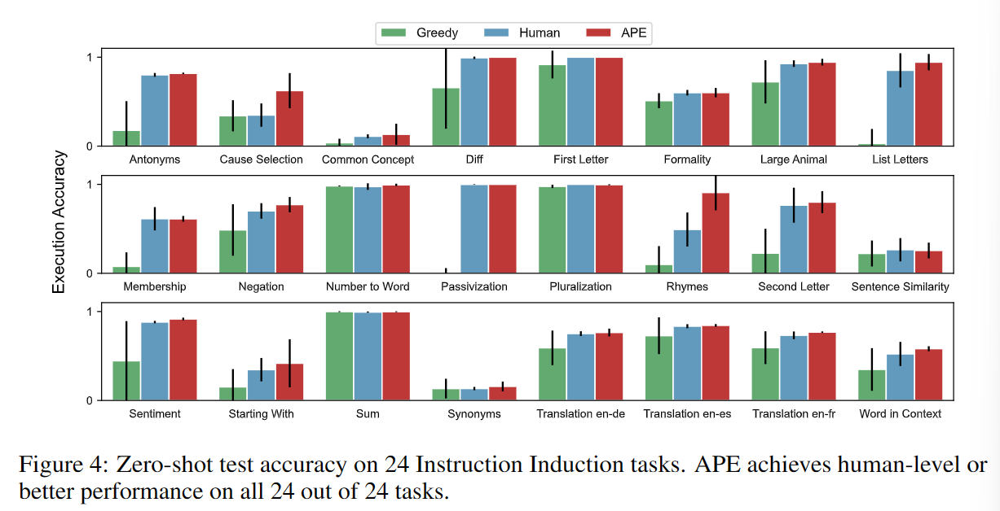
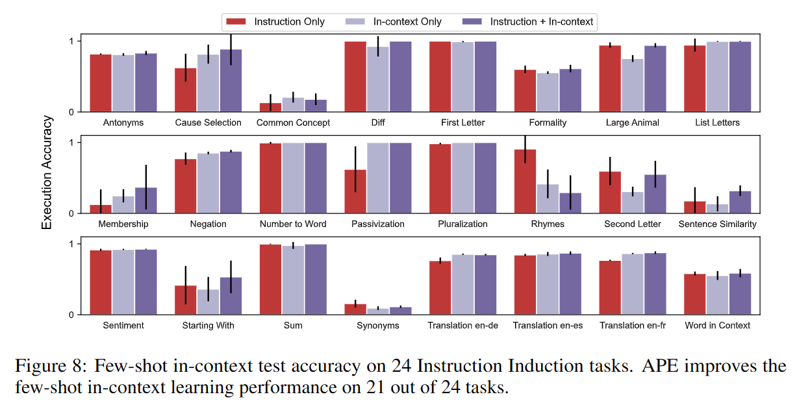
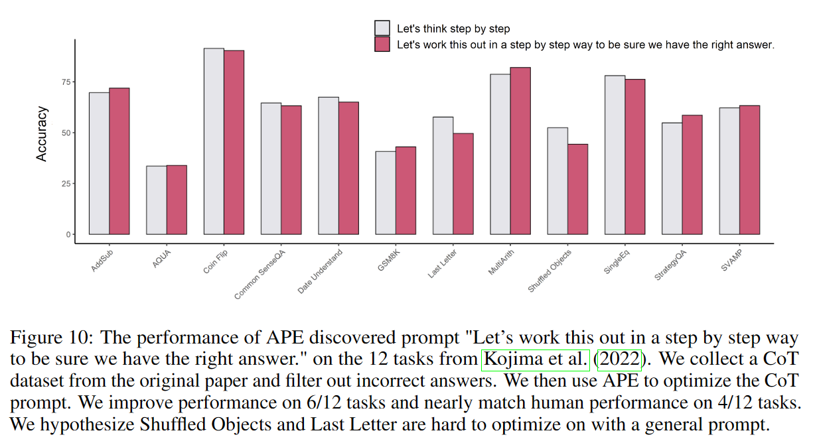

# 介绍

为了确保模型能够按照人类需求执行任务，prompt是非常有效的方式，然而构造prompt需要大量人工，本文提出了一个基于LLM生成和挑选指令的自动化算法。文中称问题为自然语言程序合成（Program Synthesis），利用LLM解决此黑盒优化问题，启发式地搜索可行解。

论文提出的算法 Automatic Prompt Engineer (APE) 流程如下：

1. 使用LLM基于以少量输入输出样例，**生成指令成员**
2. 使用LLM**计算每条指令的得分**，引导搜索过程
3. 使用迭代蒙特卡洛方法，让LLM**生成语义相似的变体**尝试提高最佳指令的性能


## 程序合成（Program Synthesis）

**定义**：自动搜索样本空间，寻找满足特定条件的程序

Program Synthesis本身是代码自动生成领域的一个概念，其核心问题是识别用户输入的意图（输入内容-输出内容，代码使用的结构等），生成符合约束条件的代码。

领域内的问题如下：

- 如何在用户输入不完整或含糊的情况下，形成完整逻辑
- 如何避免代码中的脆弱性（或确保正确性），以及如何使用验证机制加速代码生成
- 如何从曾经符号执行方法过渡到深度学习方法
- 如何解决代码以外的程序生成问题（如自然语言）

应用

- 根据用户描述（特定逻辑模板、自然语言……）生成代码
- [智能对话](https://direct.mit.edu/tacl/article/doi/10.1162/tacl_a_00333/96470/Task-Oriented-Dialogue-as-Dataflow-Synthesis)（根据用户问题，识别意图，生成API调用链进行回答）


对LLM来说，自然语言程序合成是利用LLM结构在自然语言程序空间中进行搜索，而无需额外的结构化假设和组件库。


# 方法

基本定义：

- 输入输出样例数据集 $D_{trian}=\{(Q,A)\}$ 

- 样本空间 $X$
- 测试大语言模型 $M$
- 指令 $\rho$

连接指令和原输入 $[\rho;Q]$，作为模型 $M$ 的prompt，寻找让 $f(\rho,Q,A)$ 得分最大化的指令 $\rho$：
$$
\rho^*=argmax_\rho f(\rho)=argmax_\rho \mathbb{E}_{(Q,A)}[f(\rho,Q,A)]
$$
注意，$Q$ 可能为空，此时直接优化 $\rho$ 产生输出 $\{A\}$ 的概率。

## 初始样本分布

考虑到自然语言巨大的搜索空间和语言模型生成文本的多样性，找到正确的指令会非常困难。

为了约束样本空间，首先使用预训练的LLM产生一组候选指令，指导搜索过程。尽管初始生成的指令不可能完全符合 $(Q,A)$ ，需要，但可以让LLM生成对给定输入输出对得分最高的指令，即求 $P(\rho|D_train,f(\rho)\space is \space high)$。

为此文中提出了两种方法

1. **Forward Mode Generation.** 将上面描述的概率分布转变为自然语言形式，作为模型prompt。

   

2. **Reverse Mode Generation.** Forward模式生成指令本质上是对prompt内容的补充。然而指令实际上需要出现的输入的最前面，与forward插入在末尾的形式存在冲突。我们希望产生一条能够插入在任意位置的指令。

   因此，作者提出了reverse模式，利用了LLM的填空能力（如T5、GLM、InsertGPT），推测文本中空缺的指令。

   

3. **Customized Prompts.** 作者认为根据分数计算函数的不同，合适的模板也不同，可以自行设计其他合适的prompt来生成指令。对应实验TruthfulQA的模板如下图所示。

   


## 分数计算函数

文中提出了一个衡量模型生成数据与数据集对齐程度的分数计算函数，其计算策略如下：

- **Execution accuracy.** 使用执行准确率矩阵 $f_{exec}$ 来衡量指令的质量。通常情况下，执行准确率被定义为0-1损失函数（如果预测值与目标不相等则为1，否则为0），$f(\rho,Q,A)=\mathbb{1}[M([\rho,Q])=A]$ 。在某些任务中，执行准确率被设为一个定值。
- **Log probability.** 进一步提出一个更soft的评分函数（soft是机器学习中的一个概念。指避免对类别的绝对判断，而表达每种类型的可能性），假设它会通过在搜索低质量候选指令时提供更细粒度的信号来改进优化，尤其考虑了目标模型下给定指令和问题时，期望答案的对数概率 $P(A|[\rho;Q])$。
- **Efficient score estimation.** 为训练集中的每个样例对每条指令都计算分数的开销过大。为了降低计算成本，文中给高质量的指令更多计算资源，反之亦然。这通过多层计算策略实现，首先用一小部分数据集分析所有指令，对得分高于门槛的指令，使用数据集的非重复子集再次进行得分计算，取分数的均值。重复此过程直到剩下相对较少的指令成员，再使用完整数据集进行测试。


## 迭代样本分布

显然，初始样本中的指令未必能产生一个好的指令集，要么缺乏多样性，要么因为不包含任何高分成员指令。因此，作者采用了迭代的指令集 $U$ 重取样方法——**迭代蒙特卡洛搜索**。

考虑在当前最佳候选指令的周围空间进行搜索，而不是从初始状态重新取样。这种方法产生高质量质量的可能性更高，称该方法为**迭代APE**。每个阶段，都会评估一组指令，并去除其中的低分候选，然后要求 LLM 生成与高分指令相似的新指令。这里使用的模型提示如下:



值得注意的是，尽管迭代搜索使指令的整体质量提高，但得分最高的指令在多个阶段中基本一致。所以可以认为迭代生成方式只能带来有限的提高，实验中默认采用不包含迭代搜索的APE方法。


# APE效果分析

作者从zero-shot表现、few-shot 上下文学习表现、zero-shot思维链表现和事实认知四个层面对APE的效果进行了分析。

## 指令归纳（Instruction Induction）

指令归纳：由[Honovich等人](https://arxiv.org/abs/2205.10782)2022引入，向模型提供输入-输出对演示，要求生成描述输入-输出对的自然语言指令。

这一任务包括了从简单的阶段结构到相似和因果关系识别的自然语言理解领域多个方面。实验中在InstructGPT上对**模型自己生成指令（Greedy）、人工指令、APE生成指令**三个方法进行了对比。

### Zero-shot



### Few-shot

主要展示了APE生成指令与上下文学习能力结合前后的对比




## BIGBench

作者构建了一个包含 BigBench-Hard 中9个问题，累计包含21个任务的指令归纳Benchmark—— BIG-Bench Instruction Induction (BBII)。并在此基础上对APE+InstructGPT的效果进行了评估。


## Zero-shot CoT

通过APE，作者找到了一个新的CoT prompt——Let’s work this out in a step by step way to be sure we have the right answer."

其效果比原prompt——"Let’s think step by step."略有提升。




# 开源项目

> https://github.com/keirp/automatic_prompt_engineer

文中作者对项目进行了开源。

整体流程都与论文中描述的一致，我好奇的地方在于评分函数的实现

实际上，评分函数之类内容实现的方式就是把输入输出套个模板丢进OpenAI提供的text-davinci-002接口，返回评分进行分析。

```python
def __log_probs(self, text, log_prob_range=None):
    """Returns the log probs of the text."""
    if not isinstance(text, list):
        text = [text]
    if log_prob_range is not None:
        for i in range(len(text)):
            lower_index, upper_index = log_prob_range[i]
            assert lower_index < upper_index
            assert lower_index >= 0
            assert upper_index - 1 < len(text[i])
    config = self.config['gpt_config'].copy()
    config['logprobs'] = 1
    config['echo'] = True
    config['max_tokens'] = 0
    if isinstance(text, list):
        text = [f'\n{text[i]}' for i in range(len(text))]
    else:
        text = f'\n{text}'
    response = None
    while response is None:
        try:
            response = openai.Completion.create(
                **config, prompt=text)
        except Exception as e:
            print(e)
            print('Retrying...')
            time.sleep(5)
    log_probs = [response['choices'][i]['logprobs']['token_logprobs'][1:]
                    for i in range(len(response['choices']))]
    tokens = [response['choices'][i]['logprobs']['tokens'][1:]
                for i in range(len(response['choices']))]
    offsets = [response['choices'][i]['logprobs']['text_offset'][1:]
                for i in range(len(response['choices']))]

    # Subtract 1 from the offsets to account for the newline
    for i in range(len(offsets)):
        offsets[i] = [offset - 1 for offset in offsets[i]]

    if log_prob_range is not None:
        # First, we need to find the indices of the tokens in the log probs
        # that correspond to the tokens in the log_prob_range
        for i in range(len(log_probs)):
            lower_index, upper_index = self.get_token_indices(
                offsets[i], log_prob_range[i])
            log_probs[i] = log_probs[i][lower_index:upper_index]
            tokens[i] = tokens[i][lower_index:upper_index]

    return log_probs, tokens
```

