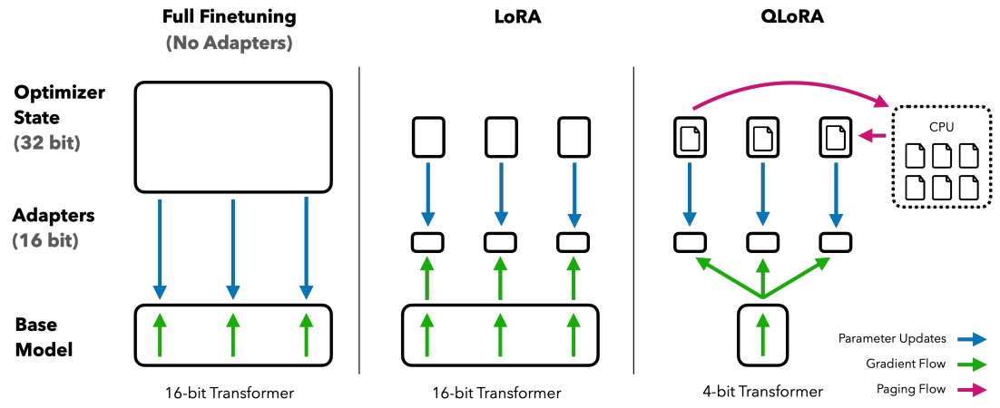
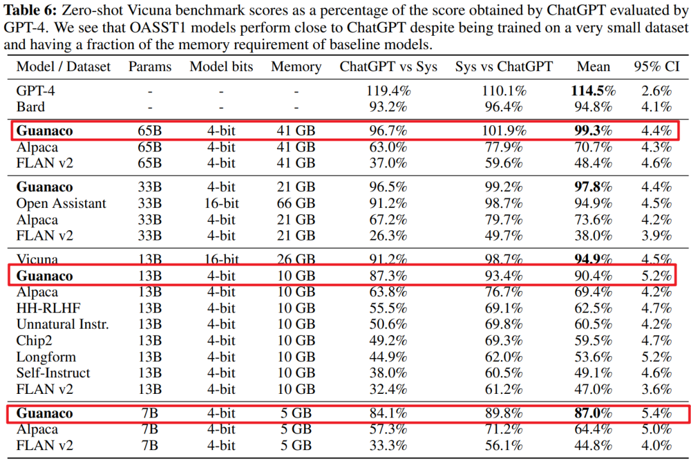

# 1. 背景

​		我们知道，大语言模型可以通过大规模的无监督预训练来学习丰富的语言知识，并通过微调来适应不同的下游任务，从而在各种NLP任务上取得了令人瞩目的性能。但是，LLM也带来了一些挑战，其中一个便是它们的巨大规模和高昂的计算成本。例如，**对650亿参数的LLaMA模型进行16位微调需要超过780GB的GPU内存**，这远远超出了普通用户和研究者拥有的资源。虽然最近的量化方法可以减少LLM的内存占用量，但是这些技术仅适用于推理，并不适合在训练过程中使用。

​		在《[QLoRA: Efficient Finetuning of Quantized LLMs](https://arxiv.org/pdf/2305.14314.pdf)》这篇论文中提出了一种针对LLM的低精度量化和高效微调技术，可以在保证完整的fp16的微调任务性能的同时，减少内存使用，从而能够**在单个48GB显存的GPU上微调65B参数模型，大大降低了微调模型所需的内存。**

# 2. 基本原理

​		在上周的汇报中提到，LoRA的原理是为LLM的每一层都添加了少量的可训练参数（适配器），并冻结了所有原始参数。这样对于微调，只需要更新适配器权重，这样可以显著减少内存占用。

​		而QLoRA更进一步，引入了三个关键的技术：

- ##### 4-bit NormalFloat (NF4)量化

​		**量化**（Quantization）是指用低精度数据类型去逼近神经网络中的高精度浮点数，以提高运算效率和减少内存占用。NF4量化是建立在分位数量化技术的基础之上的一种信息理论上最优的数据类型。NF4量化可以保证量化后的数据和量化前具有同等的数据分布。也就是通过NF4量化后，权重信息损失减少，那么最后模型的整体精度损失也减少。

- ##### 双重量化（Double Quantization）

​		Double Quantization是将额外的量化常数进行二次量化以减小内存开销的过程。假设现在每64个参数块共享一个32bit的量化常数，这样的话相当于每一个参数的量化额外开销为32/64 = 0.5 bit。这个总体来说也是比较大的开销，所以为了进一步优化这个量化开销，我们对其进行二次量化(Double Quantization)，即把第一次32bit量化的输出作为第二次量化的输入，如果采用256的块大小对量化常数进行FP8量化，那么通过计算发现，我们可以把每个参数的量化额外开销降低到：
$$
\frac{8}{64}+\frac{32}{64*256}\approx 0.127\ \mathrm{bit}
$$

- ##### 分页优化器（Paged Optimizers）

​		使用NVIDIA统一内存功能，在GPU偶尔运行内存不足的情况下，可在CPU和GPU之间自动进行页面到页面的传输，从而可实现无错误的 GPU 处理。其工作方式类似于 CPU RAM 和磁盘之间的内存分页。在 GPU 内存不足时，QLoRA会将优化器状态自动驱逐到 CPU RAM，并在优化器更新步骤中需要内存时，又将它们分页回 GPU 内存，从而保证训练正常进行下去。

​		这些步骤大大减少了微调所需的内存，同时性能几乎与标准微调相当。

# 3. 实验结果

