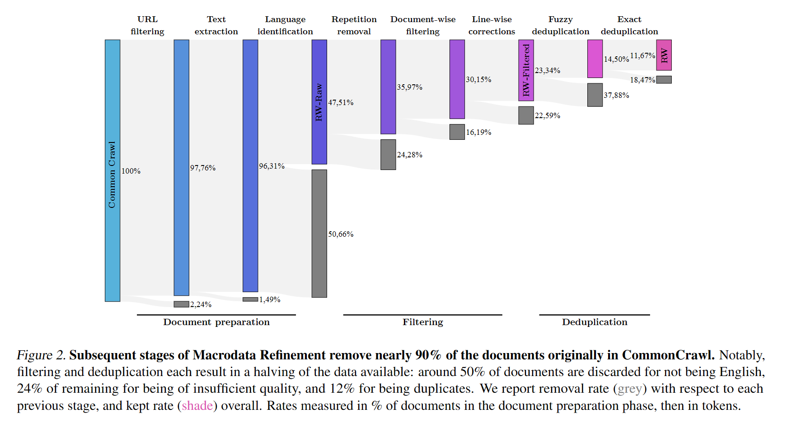

# 1. 介绍

为了最大程度在规模扩张时提高模型性能，根据Chinchilla scaling law缩放定律（2022年由Deepmind提出），模型大小和数据集大小应该同时增加。而早期的KM scaling law，则认为应该首先关注模型大小，减少数据集的增大。

scaling law：以模型大小、数据规模和总计算量作为决定模型性能的关键要素，计算资源有限时三种要素的分配方式使得模型预期性能最大化。

根据Deepmind团队的描述，理想情况下训练一个175B模型需要至少35000亿token的文本。这种规模是目前最大预训练数据集的2倍，最大公开英文数据集的10倍。

为了满足这种需求，大部分数据都是通过网络爬取的方式获得，这种数据通常被认为质量低于人工审核的数据。该文章关注了数据质量对模型训练效果的影响，做出了以下贡献：

- 制作了一个**高质量的包含5万亿token的英文数据集**——**REFINEDWEB**
- 证明了**仅使用网络数据就足够使模型性能（zero-shot能力）超过用人工审核数据集训练的模型**
- **开源了RefinedWeb中的6000亿token和基于该数据集训练的1/7B模型**

## OpenLLM排名

2023.6.19时的[OpenLLMLeaderboard](https://huggingface.co/spaces/HuggingFaceH4/open_llm_leaderboard)截图，可以看到falcon的排名很高，超越了LLaMA的同时，还有使用了更小的数据集

简而言之，在目前所有开源模型中，Falcon有最好的表现和相对较低GPU内存占用。

**对于常规的任务部署来说，Falcon-40B-Instruct是最优选择。**

# 2. 数据集构建

文中提出了MDR（MacroData Refinement），这是一个用于大规模过滤和消除CommonCrawl中web数据重复的管道。

**MDR设计准则**

- **Scale first.** 规模优先。为了能够训练40-200B的模型，优先满足数据集规模达到万亿级别的需要。数据来源于CommonCrawl来避免领域知识单一 
- **Strict deduplication.** 严格去重。结合精准和模糊去重，实现一个严格的去重流水线
- **Neutral filtering.** 中立过滤。为了避免在模型引入歧视信息，文中没有使用机器学习来过滤数据，而是使用规则和启发式方法，且仅用URL过滤成人内容

每一步过滤后剩余的数据量：

## 文档预处理

1. **数据读取**

   CommonCrawl 提供两种形式WET文件（从网页中提取得到的纯文本）和WARC文件（原始HTML响应），由于WET文件通常存在保留了无关文本的问题，因此处理从WARC文件开始。

2. **URL过滤**

   使用URL对成人网站（色情、暴力、赌博等）进行过滤，使用2个判断标准：

   - 包含460万个域名的过滤列表
   - 基于敏感词出现频率和权重计算的URL得分

3. **Text extraction 文本提取**

   使用trafilatura库和正则表达式，实现保留HTML响应中主要的文字内容，去除无关的导航栏、广告等内容。

4. **Language identification 语言识别**

   使用fastText语言分类器CCNet对语言分类，只保留英文占比高于0.65的文档。

## 文档级和行级过滤

1. **Repetition removal 去除高重复内容**

   由于爬虫错误和低质量源，许多文件包含重复序列。文中采用2019由[Rae等人](https://arxiv.org/abs/2112.11446)提出的启发式方法去除了任何行、段或n-gram重复过多的文档。

   具体实现：

   - 对行和段落，分别计算它们在整个文档重复所占比例，以及重复部分中的每个字符重复出现的比例
   - 对 $n\in\{2,3,4\}$，计算出现频率最高的n-gram的占比
   - 对 $n\in\{5,...,10\}$，计算每一个发生重复的n-gram总占比

   过滤所有比例大于门槛的文档。

   

2. **Document-wise filtering 文档过滤**

   去除垃圾邮件、特殊字符序列等内容。

3. **Line-wise corrections 行矫正**

   文档中的行有时会与不需要的内容交错，如（social media counters 3 likes, navigation buttons），文中使用行矫正过滤器，针对这些内容进行移除，如果移除内容超过文档的5%，则删除整个文档。

## 去重

由于爬虫可能多次访问同一页面或页面抄袭，不同文档间的内容仍然存在重复。

1. **Fuzzy deduplication 模糊去重**

   计算文档MinHash，衡量文档间的相似性，移除高度重复的文档组。

2. **Exact deduplication 精准去重**

   在序列级别进行精准去重。通过使用后缀数组进行精准的逐token匹配（如特殊的免责声明或通知）。

3. **URL deduplication URL去重**

   将数据集分为100个部分，在每一个部分中单独删除具有重复URL的文档。

   

